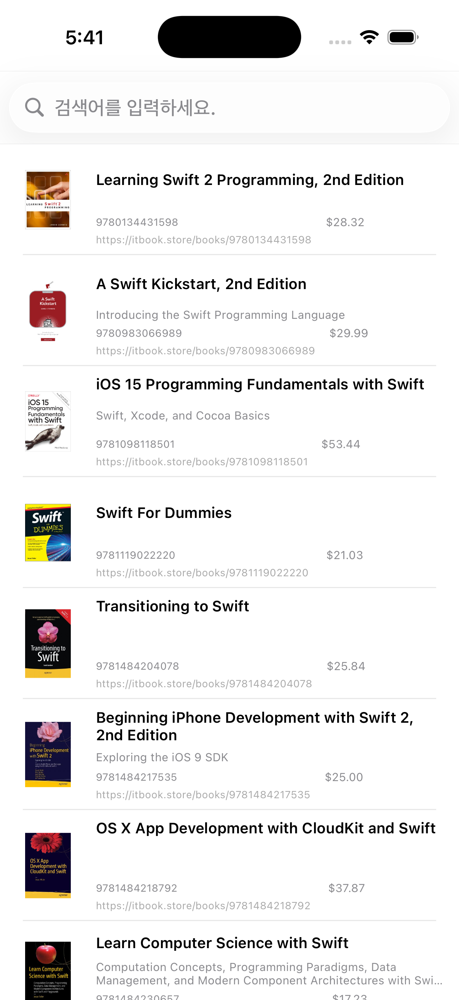
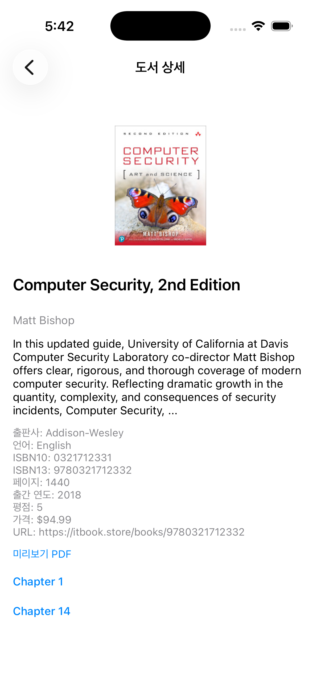
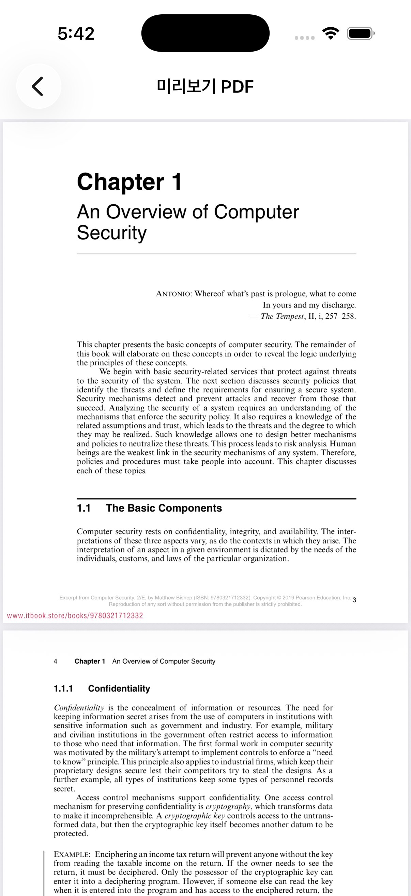

# CarrotTest

ITBookStore API 기반으로 개발된 도서 검색·상세 조회 iOS 앱 입니다.
네트워크 레이어 분리, Repository 패턴, MVVM 아키텍처, 이미지 캐싱, PDFKit 사용 등
구조적 설계와 확장성을 고려하여 구현했습니다.

주요 기능 
- 검색 :검색어를 입력해 ITBookStore API 로 책 목록 조회
- 상세 페이지: 제목·ISBN·가격·출판사·언어·pdf 링크 등 상세 정보 제공
- PDF미리보기: PDFKit 기반 뷰어로 챕터별 PDF 열람 가능
- 페이징: 검색 결과 스크롤 시 추가 페이지 자동 로드
- 캐싱: 2단계 캐싱정책 적용 Memory + Disk 캐시로 이미지 중복 다운로드 방지

사용 API 
//get
검색API: https://api.itbook.store/1.0/search/{query}/{page} 
상세API: https://api.itbook.store/1.0/books/{isbn13}

사용 기술 

- UIKit
- MVVM
- URLSession
- PDFKit
- NSCache / FileManager Disk Cache
